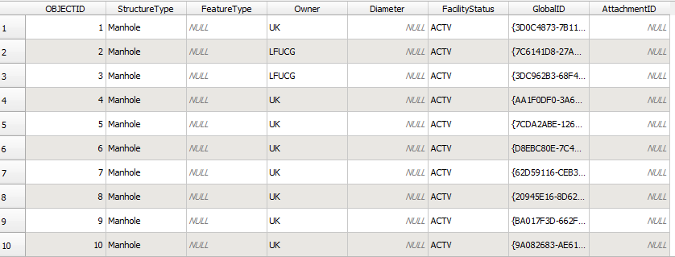
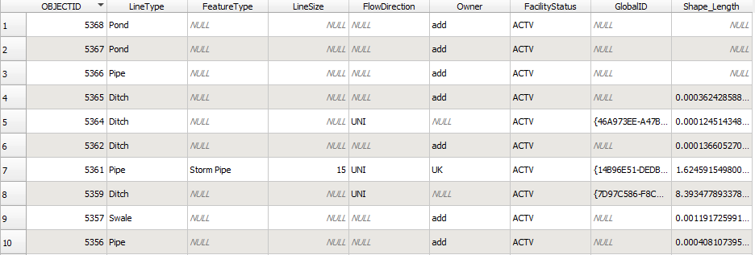
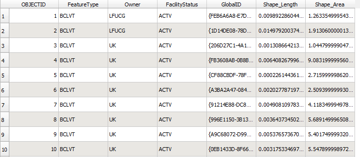

# Stormwater Flow Tracking

## Introduction

Stormwater mitigation is a monumental task for many places. It is something that almost all cities and towns have to worry about as it has a significant impact on local waterways and soils. [Stormwater](https://www.uky.edu/env/stormwater/stormwater101) is excess water that acumulates due to rain or snowmelt that doesn't get trapped into the soil. Because of this, it flows across the ground picking up all kinds of issues along the way (trash, debris, pollutants, etc.) and will eventually either seep into the soil or dispense into waterbodies, thus impacting water quality for the area. While stormwater runoff is natural, the amount is increased due to human disturbances such as building new impervious surfaces such as parking lots, sidewalks and rooftops.

This project aims to provide an interactive mapping tool that would allow users to place a "raindrop" anywhere on the University of Kentucky Main Campus, and track its' flow through campus via the many storm drains, sewers, and BMPs that all make up the University's stormwater system. With this tool, the [Environmental Quality Management](https://www.uky.edu/env/) office at UK, as well as anyone interested, will be able to see how stormwater in various places around campus can impact the whole network. We can visualize which storm sewers might recieve more stormwater than others, and is that an issue to be addressed. It will also enable the ability to track the potential impact an illicit discharge or spill could have if one were to happen. For example, if a chemical spill happened around the Chem-Phys building, where would that chemical end up? It will also enable "reverse" tracking so that we could answer the question of if a specific stormwater outlet was effected by some spill, where could the spill have originated?

## Methodology

The below sections will describe a bit about my methodology for this project. I will discuss the data I will be using, my technology stack, the general layout of my web map, my symbology choices, what kind of user interaction I have and the general aesthetics I have chosen for my project.

### Data

Data Sources:

- UK Stormwater Infrastructure
  - Source: [UK Infrastrucure Operations](https://ukgis.uky.edu/portal/apps/sites/#/ukgis)
  - This data is a collection of points, lines, and polygons representing Manholes, BMPs, Storm Sewers, Retention Basins, etc.
- UK Basemap
  - Source: [UK FIS](https://ugisserver.uky.edu/arcgis/rest/services/UK_MAP_BASE_Campus_bluegreen1_3857_ca/MapServer)
  - This is a map service layer to be used as a reference layer in the map.
- Aerial Imagery
  - Source: [UK FIS](https://ugisserver.uky.edu/arcgis/rest/services/UK_MAP_BASE_Imagery_3857_ca/MapServer)
  - This is a map service layer of the most current campus imagery.

The major data I am working with is the Stormwater Infrastructure for UK. This data is maintained by the UK Infrastructure Operations team and is housed in ESRI Geodatabases and provided through ArcGIS Server as Map/Feature Service Layers. It is actually a dataset made up a point feature class (drains, manholes, etc.), a line feature class (sewer lines, streams, etc.) and a polygon feature class (shape of detention/retention basins, streams, etc.).

For this project I decided to export these three feature classes into JSON format in a local folder. This is so I can make needed adjustments and updates without having to wait on updates being made for me, and so I do not unintentionally damage the production data.

I performed majority of my data processes in ArcGIS Pro as much of what was needed was minor adjustments of the locations such as moving a drain point slighlty so that it actually connects to the appropriate storm sewer line. Something interesting I learned is that ArcGIS Pro doesn't natively read JSON files, so I had to import those JSON files and make Feature Classes. I made a few field calculations just for readability purposes. Once majority of the data seemed clean, I then exported as GeoJSON. From that point on, if I needed to make any changes, I switched to using QGIS as it is much easier and straight forward to work with GeoJSON/JSON files. After I exported to GeoJSON, I visually checked the layers in QGIS as well as made sure they were in the correct coordinate system [EPSG: 4326](https://epsg.io/4326).

Below are snapshots of the data:

Storm Structure Points

Storm Structure Lines

Storm Structure Polygons

I plan on adding a "description" field as well as a "link" field. The description field will be used in a popup as will the link field. Description will provide a brief sentance on what that particular storm structure does, and the link will have a link to where you can find more in-depth info.

### Technology Stack

This mapping tool is a web based application that can be used both on mobile, and on desktop devices. I will be using basic HTML/CSS/JS as my framework while utilizing [Bootstrap](https://getbootstrap.com/) to help build responsive design. For the actual web map, I am using [Leaflet](https://leafletjs.com/) with some heavy lifting thanks to [Turf.js](https://turfjs.org/), and [ESRI Leaflet](https://github.com/Esri/esri-leaflet) which enables me to integrate our existing UK Basemap Service into the map.

### Layout

### Symbology

### User Interaction

### Design Choices

### Conclusion
